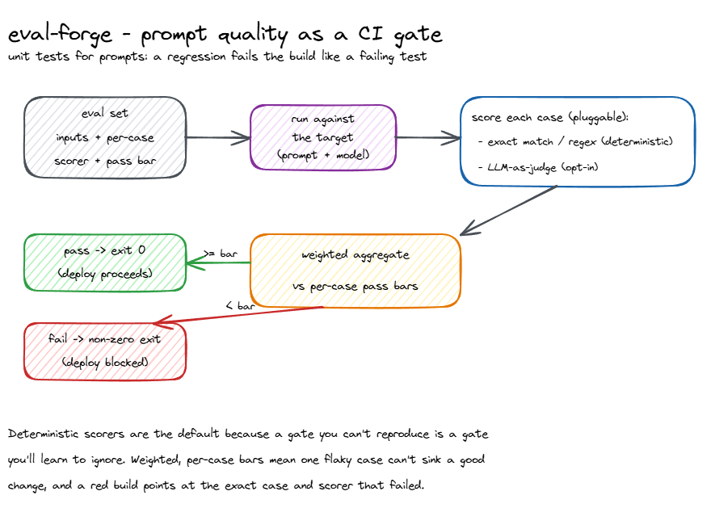

# eval-forge: design, trade-offs, and non-goals

Status: accepted
Author: Parag Sawant

Why eval-forge exists and where it draws the line. The idea is simple - treat prompt
quality like code quality, with a gate that fails the build when it regresses - but
the value is entirely in the details of what "regresses" means and how much you can
trust the number.

## Problem and goals

Prompts and the models behind them change, and without a gate you find out a prompt
got worse in production. eval-forge is the "unit tests for prompts" layer: define an
eval set (inputs, how to score each output, a pass bar), run it against your target,
and in CI a failing aggregate returns a non-zero exit code so the deploy is blocked.
Goals:

1. Make prompt quality a **CI gate**, not a manual spot-check - a regression fails the
   build the same way a failing test does.
2. Keep the scoring **transparent and deterministic** where it can be, so a red build
   is explainable, not a mystery.
3. Support **weighted, per-case pass bars** so not every check counts equally and one
   flaky case can't sink a good change on its own.

*(Source: [`docs/diagrams/ci-gate-pipeline.excalidraw`](docs/diagrams/ci-gate-pipeline.excalidraw) - editable in [excalidraw](https://aka.ms/excalidraw).)*

## Key design decisions

**Scoring is pluggable, and the built-ins are deterministic.** A case names a scorer
(exact match, regex/pattern, and so on). These are ordinary functions, so a score is
reproducible and a failure points at a specific case and scorer. Deterministic scorers
are the default because a gate you can't reproduce is a gate you'll learn to ignore;
LLM-as-judge scoring is possible through the same interface but is opt-in, precisely
because it trades reproducibility for flexibility.

**Two thresholds, on purpose.** Each case has its own `pass_score` (did this check
pass), and the eval set has an `aggregate` threshold (did the suite as a whole pass).
The aggregate is a **weighted** mean, so you can say "this case matters 3x." This
two-level design is what lets the gate be strict overall while tolerating that not
every individual check is equally important - which is how real eval suites behave.

**The gate is an exit code.** `run_eval` returns a report with `passed`, and the CLI
turns that into a process exit code. That's deliberately boring: it means eval-forge
drops into any CI system with no special integration - it's just another step that
can fail the pipeline.

## Trade-offs I made on purpose

- **Deterministic-first scoring.** The built-in scorers are exact/pattern based, which
  won't capture "is this answer *good*" the way a judge model would. I chose
  reproducibility as the default because a nondeterministic gate erodes trust fast; the
  scorer interface is the seam for adding judge-based scoring where you accept that
  trade knowingly.
- **Weighted mean, not a more elaborate aggregate.** A weighted average is easy to
  reason about and explain in a failing build. Fancier aggregation (percentile floors,
  per-category gates) would catch more nuanced regressions but makes a red build harder
  to interpret; noted as a future option rather than the default.
- **No built-in dataset management.** Eval sets are plain YAML you own and version.
  eval-forge runs them; it doesn't store, sample, or synthesize them.

## Why there's no benchmark here

eval-forge isn't on anyone's hot path - it runs a handful to a few hundred cases once
per CI run, and its cost is dominated by whatever the *target* does (a model call),
not by the runner. Reporting a throughput number would measure the wrong thing and
imply a performance concern that doesn't exist. What matters is correctness of the
gate logic - the weighted aggregate, the pass/fail thresholds, the exit code - and
that's what the test suite covers.

## Non-goals

- **Not a scoring model.** It runs scorers; it doesn't judge quality itself. Semantic
  "is this good" scoring is a scorer you plug in, with the reproducibility caveat above.
- **Not a dataset tool.** No labeling, sampling, or generation of eval sets.
- **Not an experiment tracker.** It produces a pass/fail report per run; storing and
  trending those over time is a separate concern.

Part of [parag-labs](https://github.com/parag-labs) - small, focused tools for building AI systems you can trust.
