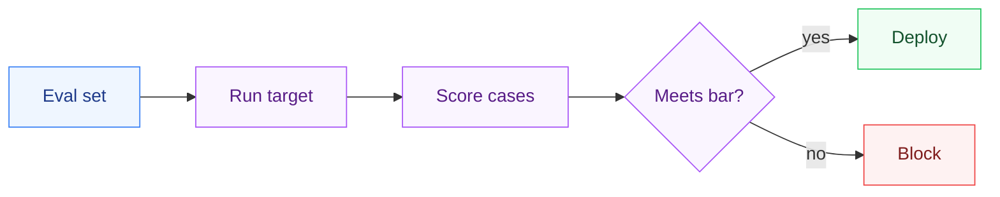

# EvalForge


**Unit tests for your prompts. A CI gate for LLM quality.**

Teams ship LLM/prompt changes and silently regress quality. EvalForge defines graded eval sets in YAML, scores your agent on every commit, and **fails the build** if quality drops below a threshold - turning eval-driven development into a real CI gate.

## Why it matters

LLM apps have no "unit tests." A prompt tweak that helps one case can quietly break ten others. EvalForge makes quality a **first-class, versioned, enforced** artifact.

## Quickstart

```bash
pip install -r requirements.txt
python -m evalforge.cli examples/eval_set.yaml --target examples.demo_target:target
```

Exit code is `0` if the aggregate score meets the threshold, non-zero otherwise - drop it straight into CI.

## Define an eval set (YAML)

```yaml
threshold: 0.75
cases:
  - id: refund-window
    input: "How many days do I have to request a refund?"
    scorer: contains
    expected: "30 days"
    weight: 2.0
    pass_score: 1.0
```

**Scorers:** `exact_match`, `contains`, `regex`, `semantic` (extensible - add LLM-as-judge, embedding cosine, etc.).

## Point it at your agent

Any `module:function` that maps `str -> str`:

```bash
python -m evalforge.cli my_evals.yaml --target myapp.agent:answer --threshold 0.85
```

## CI: catch regressions before merge

The included GitHub Action runs the eval gate on every PR. See `tests/test_evalforge.py::test_regressed_target_fails_gate` for a demonstration of a regression being caught.

## Three languages, one behavior

The scorers (including a from-scratch Ratcliff/Obershelp sequence ratio matching
Python's `difflib`), the weighted-aggregate runner, and the YAML eval-set loader —
plus the same 4 tests, run against the same `examples/eval_set.yaml` — in each
language. Each uses its platform's YAML library (pyyaml / YamlDotNet / SnakeYAML).

| Language | Tests | Run |
|----------|:-----:|-----|
| Python | 4 | `pytest -q` |
| C# (.NET 10) | 4 | `cd csharp && dotnet test` |
| Java (17+) | 4 | `cd java && mvn test` |

## How it works



## Layout

```
eval-forge/
├── evalforge/            the runner, CLI, and scorers (Python)
│   ├── runner.py       # loads a YAML eval set, runs each case, aggregates the score
│   ├── cli.py          # `python -m evalforge.cli` — the CI entry point (exit code = the gate)
│   └── scorers/        # exact_match, contains, regex, semantic — add your own here
├── csharp/               the same scorers + runner, ported to .NET 10 (xUnit + YamlDotNet)
├── java/                 the same, in Java 17+ (JUnit / Maven + SnakeYAML)
├── examples/
│   ├── eval_set.yaml   # a worked example eval set (shared by all three test suites)
│   └── demo_target.py  # a str -> str target to score against
├── tests/              # incl. a regression that proves the gate fails on a worse target
└── DESIGN.md           # deterministic-first scoring, the two-threshold model, the non-goals
```

## Design notes

- **[DESIGN.md](DESIGN.md)** - why scoring is deterministic-first, the two-threshold
  (per-case + weighted aggregate) design, why the gate is just an exit code, and the
  non-goals (it's a gate, not a scoring model or a dataset tool).

## Part of [parag-labs](https://github.com/parag-labs)

Small, focused tools for building AI systems you can trust.

LedgerRAG · **EvalForge** · AgentGuard · PromptShield · DeployKit

## License

MIT
